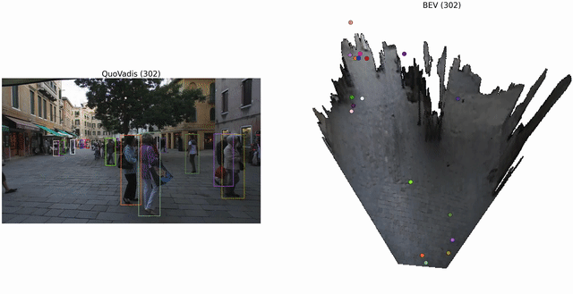
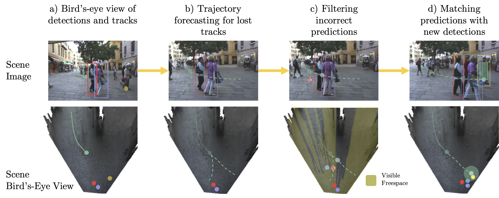

# Quo Vadis

This repository provides an implementation of Quo Vadis presented at [NeurIPS 2022](https://neurips.cc/):

[<b>Quo Vadis: Is Trajectory Forecasting the Key Towards Long-Term Multi-Object Tracking?</b>  
Patrick Dendorfer, Vladimir Yugay, Aljoša Ošep, Laura Leal-Taixé](https://arxiv.org/abs/2010.01114)  


This codebase builds upon [MG-GAN](https://github.com/selflein/MG-GAN), [AdaBins](https://github.com/shariqfarooq123/AdaBins), [Detectron2](https://github.com/facebookresearch/detectron2), [Deep-Person-ReID](https://github.com/KaiyangZhou/deep-person-reid.git), and [TrackEval](https://github.com/JonathonLuiten/TrackEval). 


## Abstract
Recent developments in monocular multi-object tracking have been very successful in tracking visible objects and bridging short occlusion gaps. However, tracking objects over a long time and under long term-occlusions is still challenging. We suggest that the missing key is reasoning about future trajectories over a longer time horizon. Intuitively, the longer the occlusion gap, the larger the search space for possible associations. In this paper, we show that even a small yet diverse set of trajectory predictions for moving agents will significantly reduce this search space and thus improve long-term tracking robustness.

<div align="center">
    
</div>

Our tracking-by-forecasting method consists of 4 steps.
<div align="center">
    
</div>


## Quickstart

We provide in [docs/QUICKSTART](docs/QUICKSTART.md) a minimum installation and single sequence dataset to run Quo Vadis. 
 
## Installation

See [docs/INSTALL.md](docs/INSTALL.md) for detailed installation instructions.

## Running Quo Vadis

```python
python run/experiments/run_quovadis.py \
  --config-file  ./run/cfgs/base.yaml \
  --dataset MOT17 \
  --tracker-name CenterTrack \
  --sequences MOT17-02 MOT17-04 \
  --save 
```
Arguments:  
`--config-file`: Path to the config file  
`--dataset`: Name of the dataset (MOT17 or MOT20)  
`--tracker-name`: Name of the tracker  
`--sequences`: List of sequences  

Optional arguments:  
`--save`: Save result tracking file \
`--vis-results`: Visualize results in image and bird's-eye view space  \
`--save-vis`: Save visualized images \
`--make-video`: Make video from visualized images \
`--eval`: Run evaluation script (requires `--save`) \
`--opts [config pairs]`: Update key-value pairs for cfgs in `<config_file_path>` 

 You can find a list of configuration arguments in [./docs/CONFIGS](./docs/CONFIGS).

## BEV Reconstruction
See [docs/BEV_RECONSTRUCTION.md](docs/BEV_RECONSTRUCTION.md) for detailed installation instructions.

<div align="center">
    
</div>

## Experiments
In the paper, we provide results on the MOT17 and MOT20 datasets. Here, we run Quo Vadis on 8 different state-of-the-art trackers on the [MOTChallenge](https://motchallenge.net/) benchmark.

### Results for MOT17
 For the MOT17 dataset, we follow the evaluation protocol used in ByteTrack and we use the first half for training and the second for evaluation. To re-run the evaluation, run ```bash run_MOT17.sh```. The numbers in () refer to the changes compared to the results of input baseline tracker.
<center> 
        <table> 
                <thead> 
                        <tr>
                                <th>MOT17</th><th>ByteTrack</th><th>CenterTrack</th><th>QDTrack</th><th>CSTrack</th><th>FairMOT</th><th>JDE</th><th>TraDeS</th><th>TransTrack</th>
                        </tr>
                <thead>
                <tbody>
                        <tr>
                                <td><b>HOTA</b</td><td>71.37 (+0.23)</td><td>61.37 (+3.15)</td><td>58.62 (+0.29)</td><td>61.32 (+0.14)</td><td>58.18 (-0.15)</td><td>51.08 (+0.23)</td><td>62.27 (+0.49)</td><td>60.77 (-0.15)</td></td>
                        </tr>
                        <tr>
                                <td><b>IDSW</b</td><td>82 (-5)</td><td>147 (-136)</td><td>230 (-23)</td><td>276 (-21)</td><td>195 (-15)</td><td>323 (-12)</td><td>106 (-32)</td><td>114 (-1)</td></td>
                        </tr>
                        <tr>
                                <td><b>MOTA</b</td><td>80.09 (+0.01)</td><td>70.75 (+0.37)</td><td>69.58 (+0.05)</td><td>71.28 (+0.02)</td><td>71.81 (+0.04)</td><td>59.54 (+0.03)</td><td>70.93 (+0.09)</td><td>69.50 (+0.00)</td></td>
                        </tr>
                        <tr>
                                <td><b>IDF1</b</td><td>83.06 (+0.56)</td><td>73.75 (+6.41)</td><td>69.96 (+0.32)</td><td>73.96 (+0.75)</td><td>73.25 (-0.09)</td><td>64.22 (+0.48)</td><td>76.13 (+0.98)</td><td>71.33 (-0.11)</td></td>
                        </tr>
                </tbody>
        </table>
</center>

### Results for MOT20
In this experiment, we use the baseline tracker trained on MOT17 and evaluate the performance of ByteTrack on the MOT20 training dataset. To re-run the evaluation, run ```bash run_MOT20.sh```. The numbers in () refer to the changes compared to the results of input baseline tracker.
<center> 
        <table> 
                <thead> 
                        <tr>
                                <th>MOT20</th><th>ByteTrack</th><th>CenterTrack</th>
                        </tr>
                <thead>
                <tbody>
                        <tr>
                                <td><b>HOTA</b</td><td>56.90 (+0.11)</td><td>34.27 (+2.18)</td></td>
                        </tr>
                        <tr>
                                <td><b>IDSW</b</td><td>1791 (-102)</td><td>5096 (-2844)</td></td>
                        </tr>
                        <tr>
                                <td><b>MOTA</b</td><td>73.38 (+0.01)</td><td>47.58 (+0.25)</td></td>
                        </tr>
                        <tr>
                                <td><b>IDF1</b</td><td>72.67 (+0.58)</td><td>46.84 (+5.12)</td></td>
                        </tr>
                </tbody>
        </table>
</center>

## Other trainable components
Our method is not yet end-to-end trainable so we rely on pre-trained components for our model. If you wish to re-train some of these components, please consult their repositories.

1. Depth Estimator
    [AdaBins](https://github.com/VladimirYugay/AdaBins/)
2. Re-ID features
    [Deep-Person-ReID](https://github.com/KaiyangZhou/deep-person-reid.git)
3. Trajectory Predictor
    [MG-GAN](https://github.com/dendorferpatrick/MG-GAN)

## License
QuoVadis is released under the [MIT license](LICENSE.md).

## Citing QuoVadis
If you use this codebase in your research, please cite our publication:

```BibTeX
@inproceedings{dendorfer2020accv,
  title={Quo Vadis: Is Trajectory Forecasting the Key Towards Long-Term Multi-Object Tracking?}, 
  author = {Dendorfer, Patrick and Yugay, Vladimir and Ošep, Aljoša and Leal-Taixé, Laura},
  year={2022},
  booktitle={Conference on Neural Information Processing Systems},
  }
```
